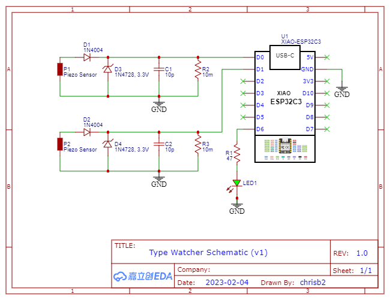

# type-watch
This project uses two piezo sensors under a keyboard to sense harsh typing and flashes an LED when a strong keystroke is detected. This feedback allows the user to train themselves to type gently, thus avoiding occupational overuse syndrome (OSS).

The program can use any MCU which supports Micropython and could be easily converted to Arduino.

The piezo sensors are [Sparkfun Piezo Elements](https://www.sparkfun.com/products/10293).

